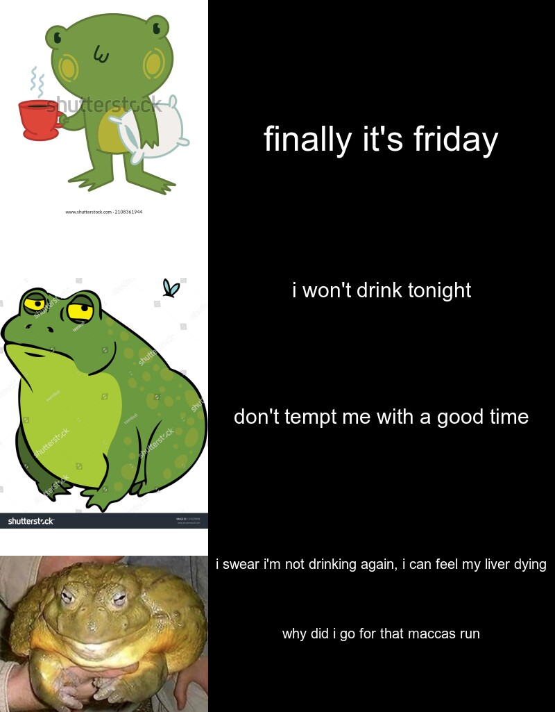

I thought it would be funny and this meme would be relatable to some people. As University students, it's frequent that we are **tempted** to go out to the pub. 
This is not an original format of memes, I was inspired to use the **Lab1A** format, as that seemed to be an effcient way of delivering my meme.  

```r
library(magick)

morning <- image_read("https://image.shutterstock.com/image-vector/cute-frog-coffee-pillow-vector-600w-2108361944.jpg") %>% 
  image_scale(300)


afternoon <- image_read("https://image.shutterstock.com/z/stock-vector-grumpy-fat-frog-cartoon-character-131635058.jpg") %>%
  image_scale(300)

night_frog <- image_read("https://i.redd.it/94ocepb1sqk41.jpg")%>%
  image_scale(300)

top_text <- image_blank(width = 500, height = 400, color = "#000000") %>%
  image_annotate(text = "finally it's friday",
                 color = "#FFFFFF",
                 size = 50,
                 gravity = "center") 
middle_text <- image_blank(width = 500, height = 400, color = "#000000") %>%
  image_annotate(text = "i won't drink tonight",
                 color = "#FFFFFF",
                 size = 30,
                 gravity = "north") %>%
  image_annotate(text = "don't tempt me with a good time",
                 color = "#FFFFFF",
                 size = 30,
                 gravity = "center")
bottom_text <- image_blank(width = 500, height = 225, color = "#000000") %>%
  image_annotate(text = "i swear i'm not drinking again, i can feel my liver dying",
                 color = "#FFFFFF",
                 size = 20,
                 gravity = "north")%>%
  image_annotate(text = "why did i go for that maccas run",
                 color = "#FFFFFF",
                 size = 20,
                 gravity = "center")
  


row1 <- c(morning, top_text)%>%
  image_append()

row2 <- c(afternoon, middle_text)%>%
  image_append()

row3 <- c(night_frog, bottom_text)%>%
  image_append()

avg_friday_meme <- c(row1, row2, row3)%>%
  image_append(stack = TRUE)

avg_friday_meme
```
